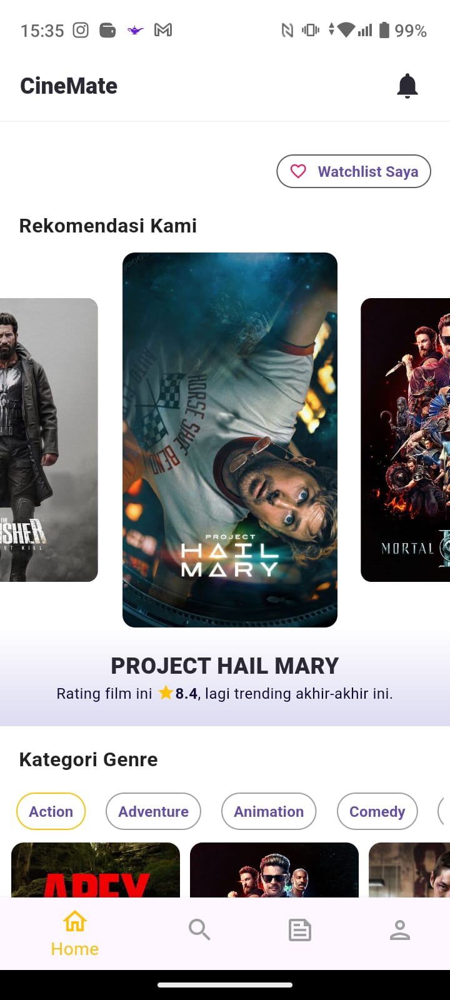
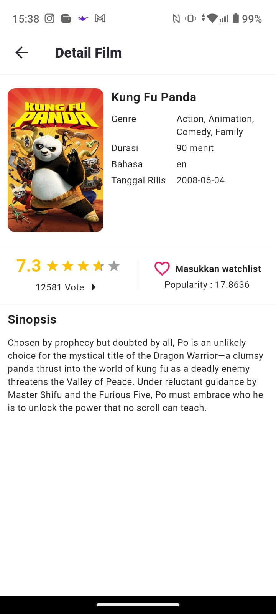

# Movie Mobile Application

A simple movie browsing mobile application built with Flutter and integrated with Open Movie API.

---

## Preview

### Home Screen

### Movie Detail Screen

### Search Feature

---

## Features

- Browse popular movies
- Search movies by title
- View movie details
- Responsive mobile UI
- Integrated with Open Movie API

---

## Tech Stack

- Flutter
- Dart
- REST API
- HTTP Package

---

## API

This project uses Open Movie API for fetching movie data.

---
